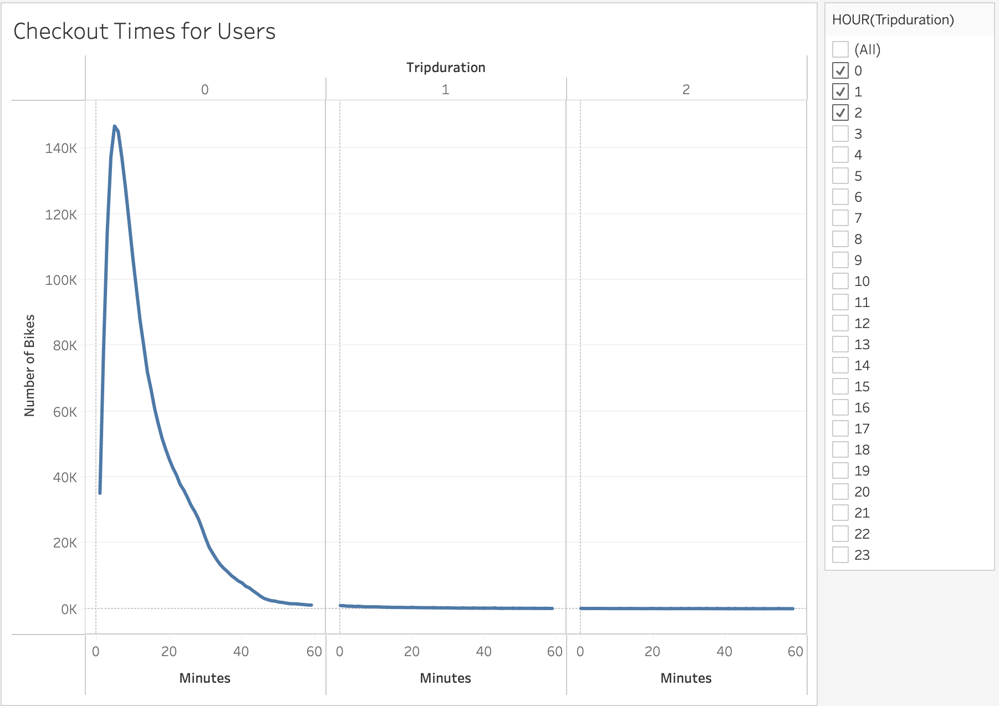
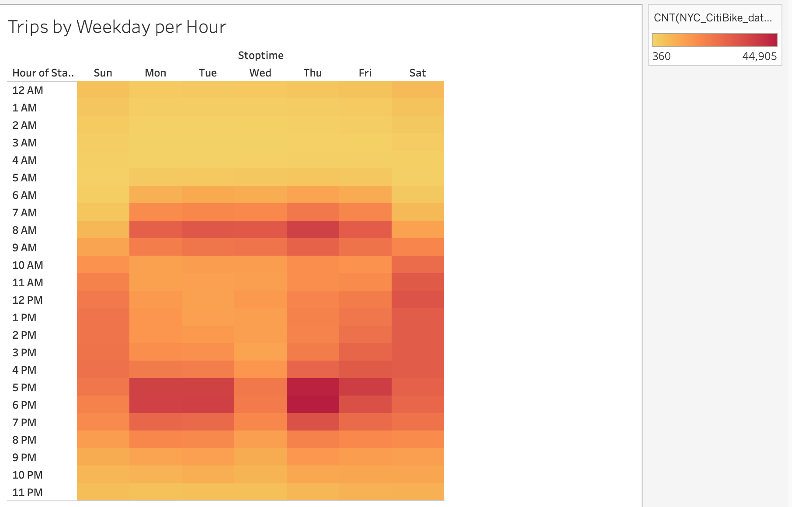
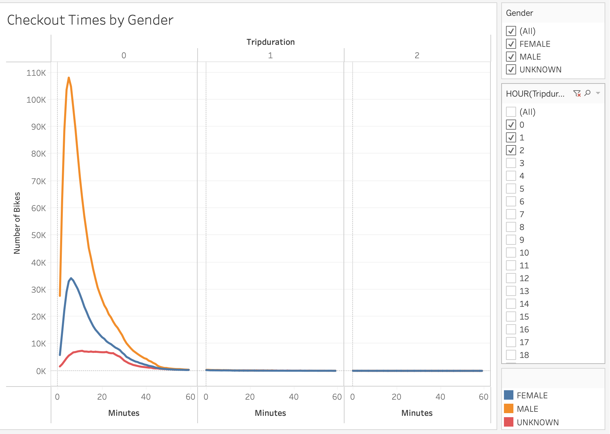
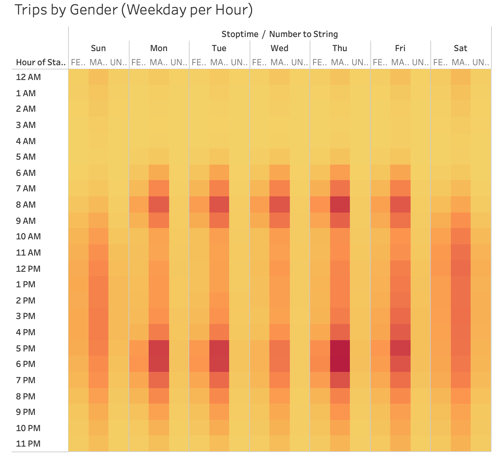
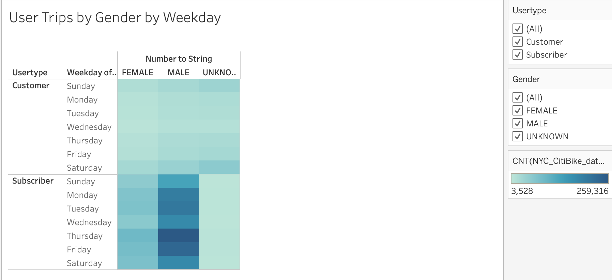
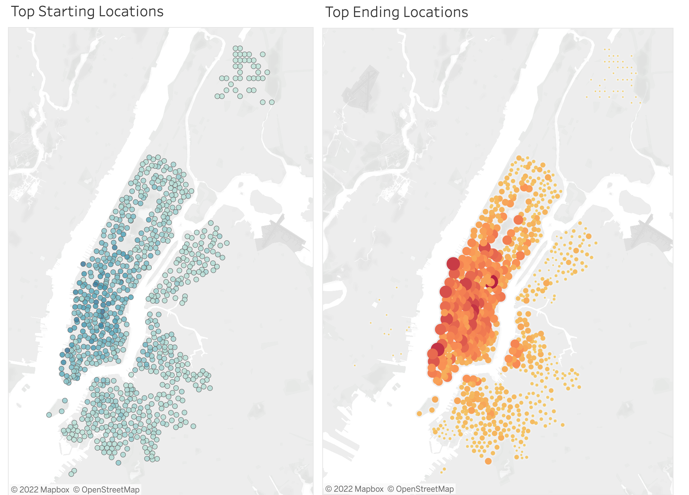

# bikesharing
## 1. Overview of the analysis

The purpose of this analysis is to convince investors that a bike-sharing program in Des Moines is a good business proposal. I created a bike trip analysis that showed the length of time that bikes are checked out for all riders and genders, the number of bike trips for all riders and geners for each hour of each day of each week, and the number of bike trips for each type of user and gender for each day of the week. I also included the top starting and ending locations for riders. 

## 2. Results

The first visualization displays the checkout duration for users. Most users have a trip duration of one hour or less, since we see a peak before 20 minutes and a decline soon after. 

The second visualization shows the breakdown of the number of trips per weekday and per hour. Based on this graph, we can see that the darker areas are around 7am to 9am and 5pm to 7pm. This means that these are the most popular times for users to checkout a bike. It makes sense, because these tend to be times before people go to work and after work. Thus, it is ideal to use a bike for transportation. Also, we can see the most popular days of the week are Thursday through Sunday, the days at the end of a week. This could imply that biking is also a leisure activity for a lot of users.

This next graph focuses on checkout times by gender. It is apparent that more males than females checkout bikes and again, the checkout time peaks before 20 minutes, so most rides last less than an hour.

Next, we see a visual of trips by gender, with a focus by weekday and by hour. Again, the pattern is similar to our previous visualization relating to checkout times by weekday by hour. We can see that most checkouts take place Monday through Friday from 7am to 9am and 5pm to 7pm. Now we can also notice the fact that most users during these times are male.  

This visualization displays user trips by gender, weekday, and user type. Based on the graph, most users are male subscribers. The most popular days for male subscribers are Thursday and Friday. 

Lastly, the added visualization is the top starting and ending locations for riders. Both graphs follow a similar pattern. They have almost the same popularity in starting and ending locations. Most of these take place on the west part of the map, to almost the center.  

## 3. Summary

Overall, there are clear conclusions from the data. As mentioned above, most users are male subscribers renting for a short amount of time, likely as a means of transportation to work around the beginning and end of their work day. For further analysis, I would look at gender and birth year of riders to get a better gauge on the users. I would also create a visualization for bike repair and trip duration, so I could figure out if the longer trips are affecting the need to repair. This would make the company more efficient and help get a better grasp on the consumers. 

[link to dashboard](https://public.tableau.com/app/profile/salman.razzaq2876/viz/NYCBikeTripAnalysis_16612164842490/NYCBikeTripStory)
